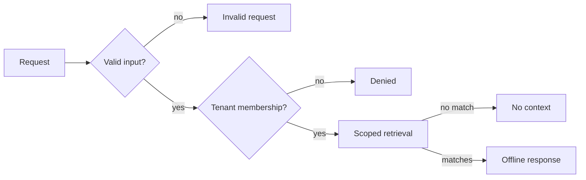

# Guarded Retrieval Graph

An offline Python example of **tenant-scoped retrieval with LangGraph and LangChain Core**. The graph validates a request, checks membership, retrieves only published documents from the selected synthetic tenant, and then invokes a response component. Rejected requests never reach retrieval or response generation.



The repository uses `StateGraph` for explicit routing, LangChain `Document` objects for evidence, and a LangChain `Runnable` as the response boundary. The default response is deterministic. **No LLM, prompt, API key, external service, database, or customer record is included.** The two tenant names and every document are fictional.

## Run locally

Use Python 3.12–3.14. No environment variables or account are needed.

```sh
python -m venv .venv
```

Activate the environment (`.venv\Scripts\Activate.ps1` on PowerShell or `source .venv/bin/activate` on macOS/Linux), then:

```sh
python -m pip install -e .
guarded-graph tenant-alpha schema
guarded-graph tenant-beta report --profile alpha-reader
python -m unittest discover -s tests -v
```

For the full local checks, also run `ruff check .`, `mypy --strict src`, `python -m pip check`, and `python -m compileall -q src` after installing the pinned lint and type-check tools in [CONTRIBUTING.md](CONTRIBUTING.md).

The first command returns a synthetic source. The second returns `denied`: the sample reader belongs to `tenant-alpha` and cannot select `tenant-beta`. To see the other allowed path, run `guarded-graph tenant-beta report --profile beta-reader`.

## Engineering choices

| Boundary | Enforcement | Evidence |
| --- | --- | --- |
| Input | Nonempty query, 160-character limit, explicit tenant format | `test_blank_or_oversized_query_is_rejected_before_retrieval` |
| Access | Principal membership and known tenant checked before retrieval | `test_cross_tenant_request_never_calls_retrieval_or_responder` |
| Data | In-memory buckets, matching tenant metadata, published state, at most three matches | `test_unpublished_and_misfiled_documents_are_never_returned` |
| Response | Receives only allowed matches; errors return no answer or sources | `test_responder_receives_only_bounded_scoped_documents` |
| Output | Exposes status, answer, and source IDs; omits principal and graph state | `test_authorized_query_returns_only_scoped_published_sources` |

See [architecture](docs/ARCHITECTURE.md) for the graph and trust boundaries, and [security](SECURITY.md) for the example's limits. The local CLI supplies fictional principals. In a real application, an authenticated server would create the principal; a caller-selected profile is **not authentication**. The in-memory filter is an educational boundary, not a database authorization policy or proof of production isolation. This project does not execute actions or send messages.

## Resumo em português

Exemplo executável de busca isolada por tenant com LangGraph e componentes do LangChain. O grafo valida a entrada, verifica o vínculo do usuário fictício, limita a busca a documentos sintéticos publicados e só então produz uma resposta local. Testes cobrem acesso permitido, negação, documento mal classificado, rascunho, ausência de contexto e falha na resposta. Não há modelo de IA nem integração externa; o objetivo é tornar verificáveis as fronteiras de autorização e orquestração.
