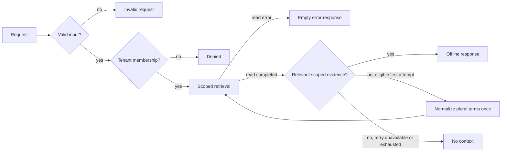

# Guarded Retrieval Graph

An offline Python example of **tenant-scoped retrieval with LangGraph and LangChain Core**. The graph validates a request, checks membership, retrieves only published documents from the selected synthetic tenant, evaluates lexical relevance, and then invokes a response component. A plural query with no relevant result can make one bounded, deterministic retry. Rejected requests never reach retrieval or response generation.



The repository uses `StateGraph` for explicit routing, LangChain `Document` objects for evidence, and a LangChain `Runnable` as the response boundary. The default response is deterministic. **No LLM, prompt, API key, external service, database, or customer record is included.** The two tenant names and every document are fictional.

## Run locally

Use Python 3.12–3.14 and uv 0.12.15. No environment variables or account are needed. The committed `uv.lock` pins runtime and development dependencies for the supported Python versions.

```sh
python -m pip install uv==0.12.15
uv sync --locked
```

```sh
uv run --locked guarded-graph tenant-alpha schema
uv run --locked guarded-graph tenant-alpha alerts
uv run --locked guarded-graph tenant-beta report --profile alpha-reader
uv run --locked python -m unittest discover -s tests -v
```

For the full local checks, also run `uv run --locked ruff check .`, `uv run --locked mypy --strict src`, `uv pip check`, and `uv run --locked python -m compileall -q src`.

The first command returns a synthetic source. The `alerts` query has no exact lexical match on its first read; one retry with `alert` returns a fictional source. The third command returns `denied`: the sample reader belongs to `tenant-alpha` and cannot select `tenant-beta`. To see the other allowed path, run `guarded-graph tenant-beta report --profile beta-reader`.

## Engineering choices

| Boundary | Enforcement | Evidence |
| --- | --- | --- |
| Input | Nonempty query, 160-character limit, explicit tenant format | `test_blank_or_oversized_query_is_rejected_before_retrieval` |
| Access | Principal membership and known tenant checked before retrieval | `test_cross_tenant_request_never_calls_retrieval_or_responder` |
| Data | In-memory buckets, matching tenant metadata, published state, at most three matches | `test_unpublished_and_misfiled_documents_are_never_returned` |
| Evaluation and retry | Lexical overlap, explicit attempt count, at most two scoped reads; retrieval errors stop immediately | `test_allowed_plural_query_recovers_with_one_scoped_retry`, `test_no_context_stops_after_at_most_two_reads` |
| Response | Receives only allowed matches; errors return no answer or sources | `test_responder_receives_only_bounded_scoped_documents` |
| Output | Exposes status, answer, and source IDs; omits principal and graph state | `test_authorized_query_returns_only_scoped_published_sources` |

See [architecture](docs/ARCHITECTURE.md) for the graph and trust boundaries, and [security](SECURITY.md) for the example's limits. The retry removes a trailing `s` from eligible search terms; it is an illustrative lexical fallback, not semantic retrieval or an AI planning loop. The local CLI supplies fictional principals. In a real application, an authenticated server would create the principal; a caller-selected profile is **not authentication**. The in-memory filter is an educational boundary, not a database authorization policy or proof of production isolation. This project does not execute actions or send messages.

## Resumo em português

Exemplo executável de busca isolada por tenant com LangGraph e componentes do LangChain. O grafo valida a entrada, verifica o vínculo do usuário fictício, limita a busca a documentos sintéticos publicados, avalia a relevância lexical e só então produz uma resposta local. Uma consulta no plural pode receber uma única nova tentativa determinística. Testes cobrem acesso permitido, negação, limite de tentativas, documento mal classificado, rascunho, ausência de contexto e falhas. Não há modelo de IA nem integração externa; o objetivo é tornar verificáveis as fronteiras de autorização e orquestração.
